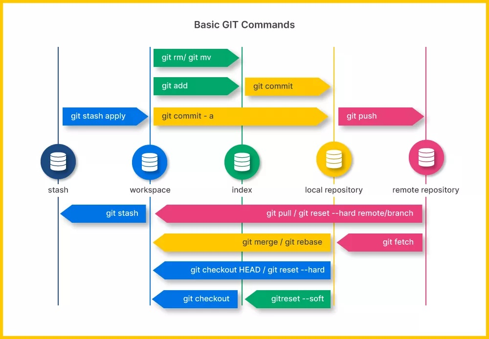

# Summary

- This programming project was created with one purpose: to facilitate and help my understanding of Git, through teaching and educating new programmers.

# General objective

- learn git professionally

# Topics List

- 01: Learn how to install and configure my Git.

# Commands List

| Command | Description |
| :-----: | :-----: |
| git branch nameNewBranch | crea una nueva rama |
| git branch | lista las ramas |
| git branch -a | listar ramas del remoto |
| git branch -r | ? |
| git checkout | ? |
| git checkout -b nombre-de-la-rama | crear y cambia a la rama |
| git checkout nameBranch | cambiar a la rama nombrada |
| git remote -v | ver origen del repo |
| git log --oneline | ver ultimo commit |
| git log --oneline -5 | ver ultimos n commits |
|  |  |
|  |  |
|  |  |
|  |  |
|  |  |
|  |  |

# Acutalizar mi repositorio

- git checkout main
- git pull origin main

# Acutalizar mi repositorio

# bibliography:

- If you don't understand my explanation or if you want to learn more on your own, you can check the official git page. and access your own documentation:

- https://git-scm.com/downloads

- https://docs.github.com/en/authentication/connecting-to-github-with-ssh/generating-a-new-ssh-key-and-adding-it-to-the-ssh-agent

# End
